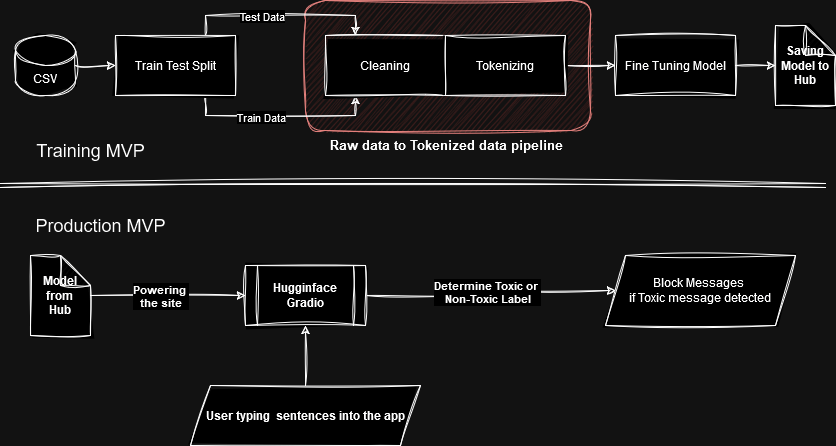

# Toxic comments severity

## Team Member : Bryan Goh Ying Chung | Daniel Lim Yuan Lee | Ng Tow Boon | Ong Wee Chong, Alex

### Mini-Project for Assessing Toxicity of Online comments

## Requirements

- **Python** == 3.11
- [PDM](https://pdm-project.org/latest/) - This project uses PDM to manages all dependencies. Please refer to [PDM documentation](https://pdm-project.org/latest/) to install accordingly.

## Pipeline Overview

## Dataset from Kaggle 

https://www.kaggle.com/datasets/shivamb/combined-jigsaw-comments-corpus

- This project predict the toxic severity of a given input, training on dataset of 2 million movie comments.  

- Goal is to predict score of toxic_comments_severity from 0 (a little toxic) to 1 (toxic)

- Project will be using Gradio from Demo purpose, key in any sentence, model will predict the severity of toxic.

- Model: https://huggingface.co/martin-ha/toxic-comment-model

## Demo with Gradio

To launch Gradio demo app, please ensure that all prerequisite are met.

Running app within pdm venv `python ./src/app.py`